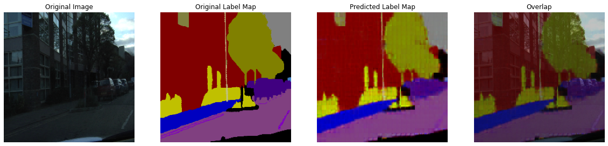
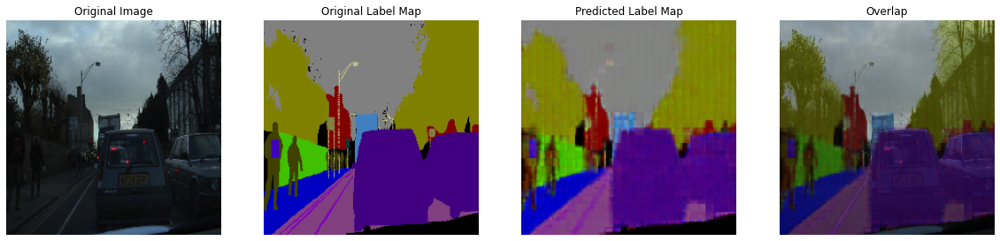
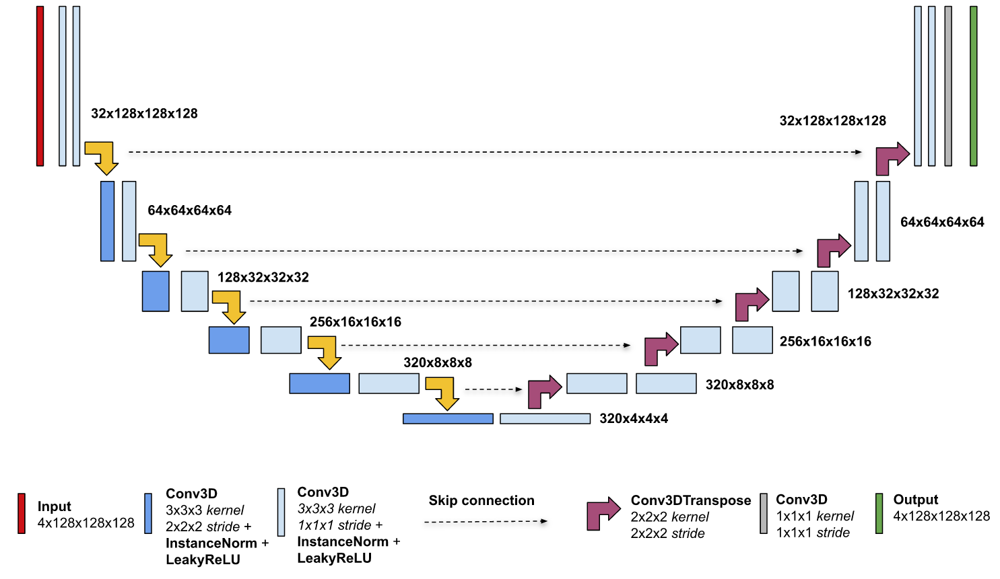
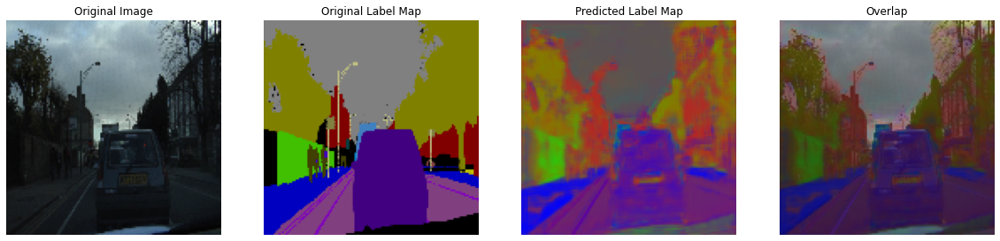
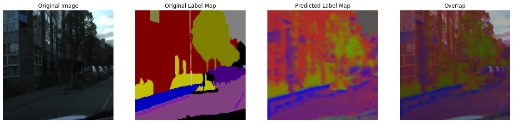
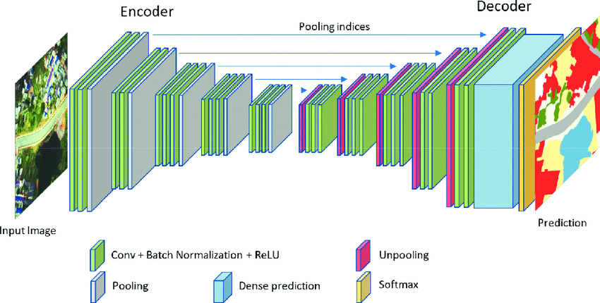
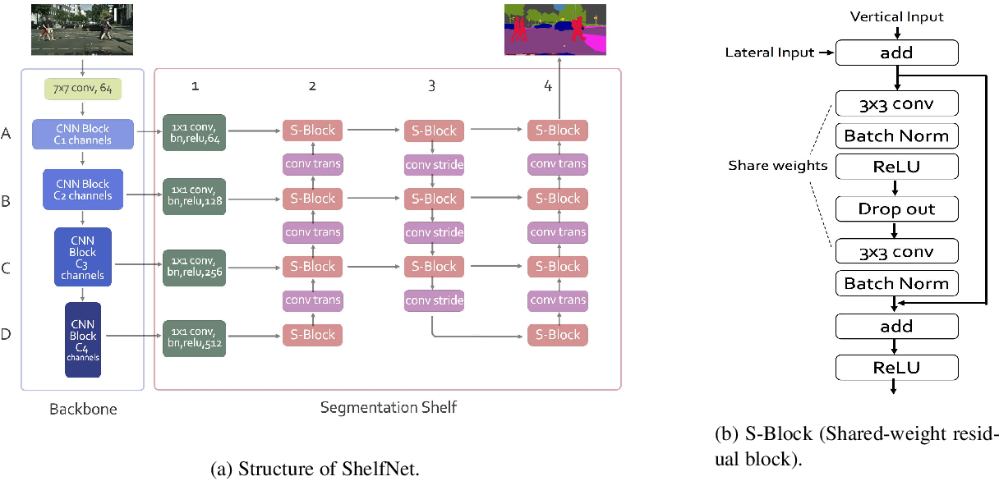

# Semantic-Segmentation
Build some semantic segmentation models as FCN-8. U-Net, DeepLab, SegNet, OCNet, PSPNet and ShelfNet and train them on CamVid dataset

## Dataset
[CamVid (Cambridge-Driving Labeled Video Database)](https://www.kaggle.com/datasets/carlolepelaars/camvid)
The Cambridge-driving Labeled Video Database (CamVid) provides ground truth labels that associate each pixel with one of 32 semantic classes. This dataset is often used in (real-time) semantic segmentation research.

The dataset is split up as follows:

- 367 training pairs
- 101 validation pairs
- 233 test pairs

## Models

### 1. Fully Convolutional Network (FCN-8)
#### Model Architecture

#### Results

### 2. U-net
#### Model Architecture

#### Results

### 3. SegNet
#### Model Architecture

### 4. ShelfNet
#### Model Architecture

#### Results

## Resources
- [1. Fully Convolutional Networks for Semantic Segmentation](https://arxiv.org/abs/1605.06211v1)
- [2. U-Net: Convolutional Networks for Biomedical Image Segmentation](https://arxiv.org/abs/1505.04597v1)
- [3. SegNet: A Deep Convolutional Encoder-Decoder Architecture for Image Segmentation](https://arxiv.org/abs/1511.00561v3)
- [4. ShelfNet for Fast Semantic Segmentation](https://arxiv.org/abs/1811.11254v6)

## Tools

- Python
- Tensorflow
- Numpy
- matplotlib